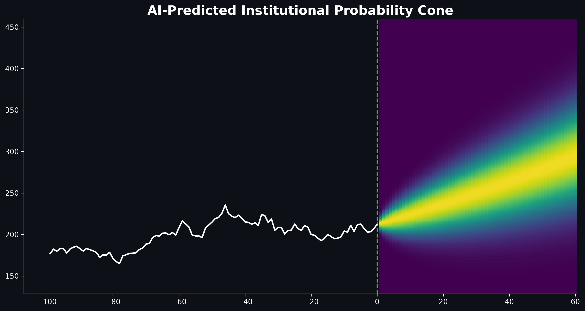
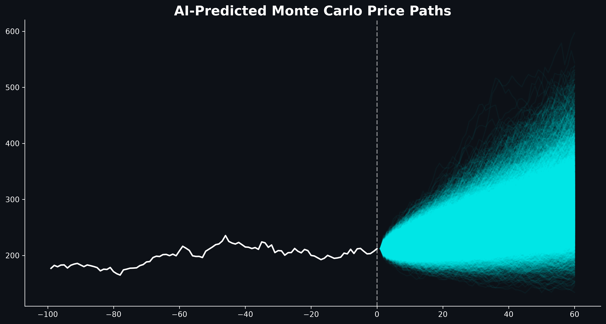
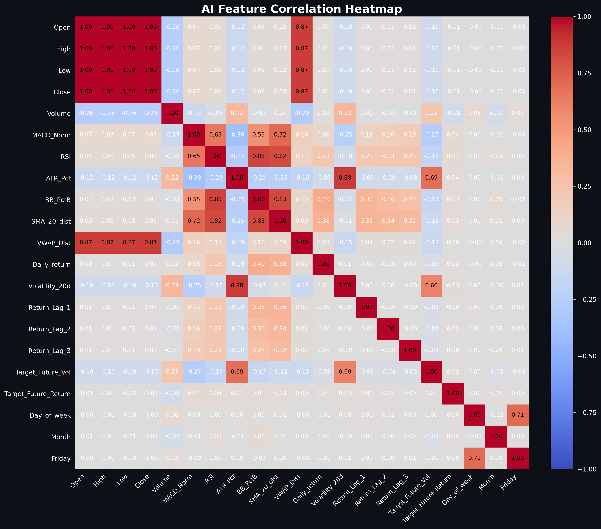

# Stock Price Predictions 📈

Forecasts NVIDIA's 21-trading-day forward return and volatility from technical indicators using XGBoost, then visualizes the forecast as a probability cone and a 10,000-path Monte Carlo simulation.

## Results





The probability cone and Monte Carlo fan chart are both driven by a single point forecast (predicted 21-day return and volatility) from the two XGBoost models, projected forward as a Gaussian cone and as simulated GBM paths respectively. The correlation heatmap is a sanity check on the engineered feature set before training.


## What it does

- Pulls NVDIA's full daily price history via `yfinance`
- Engineers technical and calendar features from OHLCV data: MACD (normalized), RSI(14), ATR% (14), Bollinger %B (20), distance from the 20-day SMA, distance from a cumulative VWAP, 20-day realized volatility, 3 lagged daily log returns, and day-of-week/month/Friday flags
- Defines two forward-looking targets over a 21-trading-day horizon — realized volatility and cumulative return — using `shift(-21)` so each label is built strictly from the days *after* its row
- Trains two independent `XGBRegressor` models (one per target) on a chronological 80/20 split
- Feeds the most recent day's features into both models to get a single forecast, then builds an analytical probability cone and a Monte Carlo GBM simulation from it
- Saves three plots to `assets/`: probability cone, Monte Carlo fan chart, and a feature correlation heatmap

## Tech stack


## Model

```python
XGBRegressor(n_estimators=100, max_depth=5, random_state=42)  # one instance per target
```

**Features:** `MACD_Norm`, `RSI`, `ATR_Pct`, `BB_PctB`, `SMA_20_dist`, `VWAP_Dist`, `Daily_return`, `Volatility_20d`, `Return_Lag_1`, `Return_Lag_2`, `Return_Lag_3`, `Day_of_week`, `Month`, `Friday`

**Targets:** `Target_Future_Vol` (21-day forward realized volatility), `Target_Future_Return` (21-day forward simple return)

## Running it

```bash
pip install -r requirements.txt
python main.py
```

Prints the current price and the predicted 21-day return/volatility to stdout, and writes the three plots above to `assets/`.

## Methodology notes

- Every indicator is built with trailing rolling windows, `.ewm()`, or `.shift()`, so no feature uses information from a day after the one it describes.
- Both targets are built in the opposite direction on purpose — `shift(-21)` — so a row's label is defined only by the 21 trading days that follow it, never by data at or before that row.
- The train/test split is chronological (`shuffle=False`), which rules out the most obvious leak (training on the future). It does not fully rule out a subtler one — see below.

## Limitations

- **No evaluation is computed.** `X_test`/`y_vol_test`/`y_ret_test` are created by the split but never scored — there's no MAE, RMSE, or directional-accuracy check, so there's currently no evidence either model outperforms a naive baseline (e.g. last-21-day realized vol as the vol forecast, 0% as the return forecast). Top priority fix.
- **Overlapping-window boundary effect.** Because each label depends on the 21 days *after* its row, the last ~21 training rows have targets computed from price data that also falls inside the test set — a plain chronological split doesn't separate train and test as cleanly as it would for a single-day-ahead label. An embargo at the split boundary, or walk-forward validation, would close this.
- **VWAP is cumulative since the start of the price history**, not rolling — it's a `cumsum()` over the entire dataset, so after two decades of NVDA data it's extremely smoothed and largely redundant with `SMA_20_dist`.
- **Return-convention mismatch:** `Daily_return` is a log return, but `Target_Future_Return` is a simple return; `predicted_ret / 21` is then used as a per-day log drift inside the GBM simulation, mixing the two conventions.
- Single hardcoded ticker (NVDA); no baseline model; no hyperparameter search.
